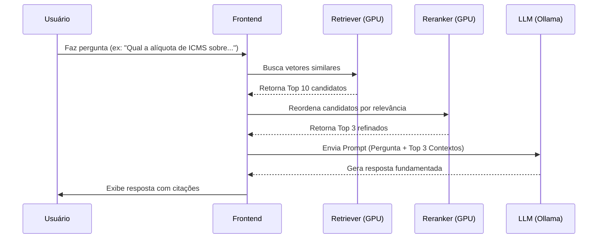

# Arquitetura Detalhada — IA_leg

O IA_leg é baseado em uma arquitetura de **Retrieval-Augmented Generation (RAG)** modular, projetada para escalabilidade e precisão jurídica. Este documento detalha o funcionamento de cada componente.

---

## 1. Core Pipeline (6 Estágios)

### 1.1 Crawler (`crawler/`)
*   **Função**: Extrair dados brutos da API de Legislação da SEFIN-RO.
*   **Output**: Arquivos JSON brutos contendo o texto integral e metadados (tipo de norma, número, ano, data de publicação).

### 1.2 ETL & Parsing (`etl/`)
*   **Função**: Limpar o HTML/JSON e segmentar o texto.
*   **Estratégia de Chunking**: O sistema não corta o texto por tamanho fixo, mas sim por **unidade lógica (Artigos)**. Isso garante que o contexto jurídico não seja quebrado ao meio.
*   **Metadados**: Cada "chunk" é vinculado ao seu ID de dispositivo, versão da norma e status de vigência.

### 1.3 Embeddings (`-m ia_leg.rag.embedding_service`)
*   **Modelo**: `BAAI/bge-m3` (famoso por sua performance em português e suporte a múltiplos idiomas).
*   **Otimização**: Os embeddings são gerados na GPU (CUDA) e salvos como blobs binários no banco de dados.
*   **Processamento**: Atualmente lida com ~13k dispositivos legais.

### 1.4 Retriever (`rag/retriever.py`)
*   **Algoritmo**: Similaridade de Cosseno.
*   **Implementação**: Utiliza matrizes NumPy para cálculos vetorizados ultra-rápidos.
*   **Cache**: Os vetores são carregados na memória RAM durante a inicialização (Warm-up) para permitir buscas em milissegundos.

### 1.5 Reranker (`rag/reranker.py`)
*   **Conceito**: Cross-Encoder.
*   **Modelo**: `ms-marco-MiniLM-L-6-v2`.
*   **Por que usar?**: Enquanto o Retriever é rápido (Bi-Encoder), o Reranker é mais inteligente (Cross-Encoder). Ele analisa a relação profunda entre a pergunta e os contextos candidatos, reduzindo drasticamente "falsos positivos".

### 1.6 Prompt Engine (`rag/prompt_engine.py`)
*   **Orquestração**: Combina a pergunta do usuário com o contexto recuperado.
*   **Instructions (System Prompt)**: Otimizado para atuar como um Revisor Fiscal, exigindo citações literais e proibindo alucinações.
*   **Integração LLM**: Comunicação via API local com o **Ollama**.

---

## 2. Interface (`frontend/`)

*   **Tecnologia**: React SPA, Vite, TypeScript, Tailwind CSS, e React Router.
*   **Funcionalidades**:
    *   **Chat Inteligente**: Interface de conversação.
    *   **Painel de Estatísticas**: Visão geral da base indexada.
    *   **Explorador de Normas**: Navegação hierárquica por tempo e tipo.

---

## 3. Fluxo de Dados

---

## 4. Stack Tecnológica

| Camada | Tecnologia |
|--------|------------|
| **Linguagem** | Python 3.11 |
| **Interface** | React / TypeScript / Vite |
| **Banco de Dados** | SQLite (Metadados + Vetores) |
| **Deep Learning** | PyTorch / CUDA 12.1 |
| **NLP** | Sentence-Transformers / Ollama |
| **Processamento** | Polars / Pandas / NumPy |

---
**SEFIN-RO** | 2026
