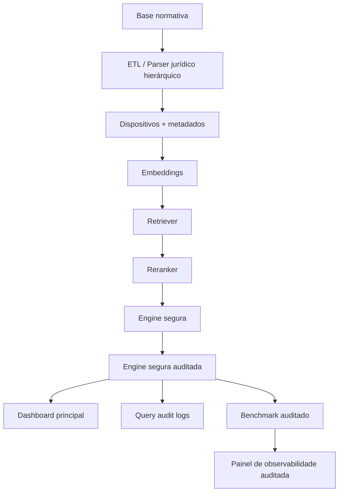

# IA_leg — Revisor Fiscal Inteligente (SEFIN-RO)

Sistema de consulta jurídica com **RAG auditável** para legislação tributária de Rondônia.

Esta branch consolida um núcleo de melhoria focado em quatro frentes:
- **segmentação jurídica hierárquica** para artigos, parágrafos, incisos e alíneas;
- **resposta segura com citações verificáveis**;
- **trilha auditada de consultas** com registro de fallback, score e fontes usadas;
- **benchmark auditado** e painel de observabilidade operacional.

---

## Estado operacional desta branch

O caminho operacional recomendado nesta branch é:
1. ingestão e indexação da base;
2. consulta pelo dashboard Streamlit principal;
3. observabilidade pelo painel auditado;
4. benchmark pelo runner auditado.

### Interfaces recomendadas

**Consulta principal**
```bash
streamlit run dashboard/app.py
```

**Observabilidade auditada**
```bash
streamlit run dashboard/observability_audit_app_v2.py
```

### Benchmark recomendado

```bash
python scripts/benchmark_ia_leg_audited.py
```

Saída padrão:
- `ia_leg/observability/benchmark_resultados_auditados.json`

---

## Arquitetura consolidada



### Componentes principais

- `ia_leg/etl/legal_parser.py`  
  Parser jurídico hierárquico.

- `ia_leg/rag/citation_guard.py`  
  Validação de âncoras verificáveis e fallback seguro.

- `ia_leg/rag/answer_engine_safe.py`  
  Trilha segura base.

- `ia_leg/rag/answer_engine_safe_audited.py`  
  Trilha segura com auditoria detalhada.

- `sitecustomize.py` e `usercustomize.py`  
  Consolidação do comportamento seguro/auditado no fluxo principal sem alterar diretamente todos os pontos antigos do projeto.

- `ia_leg/observability/audit_logger.py`  
  Persistência de auditoria em tabela própria.

- `ia_leg/observability/benchmark_runner_audited.py`  
  Benchmark auditado com campos alinhados à trilha de auditoria.

- `dashboard/observability_audit_app_v2.py`  
  Painel consolidado de observabilidade.

---

## Tabelas e logs relevantes

### Tabela principal da trilha auditada
- `query_audit_logs`

Campos relevantes:
- `fallback_reason`
- `max_score`
- `source_anchor_ok`
- `source_identifiers`
- `source_normas`
- `search_time_ms`
- `rerank_time_ms`
- `llm_time_ms`
- `total_time_ms`

### Tabela legada de compatibilidade
- `query_logs`

Nesta branch, `query_logs` continua existindo por compatibilidade histórica, mas o **foco operacional** da auditoria está em `query_audit_logs`.

---

## Como operar

### 1. Setup
```bash
python -m ia_leg setup
```

### 2. Ingestão
```bash
python -m ia_leg ingest
```

### 3. Indexação
```bash
python -m ia_leg index
```

### 4. Consulta
```bash
streamlit run dashboard/app.py
```

### 5. Benchmark auditado
```bash
python scripts/benchmark_ia_leg_audited.py \
  --query-file ia_leg/observability/benchmark_queries_sefin_expanded.json
```

### 6. Observabilidade auditada
```bash
streamlit run dashboard/observability_audit_app_v2.py
```

---

## Variáveis úteis

```bash
IA_LEG_ENABLE_SAFE_PATCHES=1
IA_LEG_SAFE_TOP_K=5
IA_LEG_SAFE_MIN_SCORE=0.20
IA_LEG_SAFE_REQUIRE_ANCHORS=1
```

---

## Validação antes de merge

```bash
pytest tests/
python scripts/pre_merge_audit_check.py
python scripts/benchmark_ia_leg_audited.py
```

---

## Observações importantes

- O frontend React continua existindo no repositório, mas **não é o caminho operacional principal desta branch**.
- A consolidação do fluxo principal FOI REFATORADA para não depender mais de `sitecustomize.py` e `usercustomize.py` (monkey patches). A nova abordagem utiliza um Factory Pattern explícito, selecionável pela variável de ambiente `IA_LEG_ENGINE_MODE`.
- O painel auditado v2 é o **painel recomendado** para leitura de benchmark e auditoria nesta branch.

---

## Documentação complementar

- `OPERACAO_AUDITADA_MAR2026.md`
- `MERGE_CHECKLIST_MAR2026.md`

---
**SEFIN-RO** | Desenvolvimento Interno | 2026

## ⚙️ Modos de Execução da Engine (Arquitetura Auditável)

Para garantir previsibilidade, rastreabilidade e evitar acoplamento oculto (monkey patches), o IA_leg agora utiliza uma arquitetura baseada em **Factory** (`ia_leg/app/factory.py`) para injetar as estratégias de busca e RAG.

Os scripts legados (`sitecustomize.py` e `usercustomize.py`) **foram depreciados** e não possuem mais efeitos colaterais na importação.

Para configurar o comportamento de ponta-a-ponta, defina a variável de ambiente `IA_LEG_ENGINE_MODE` antes de iniciar a aplicação:

- `IA_LEG_ENGINE_MODE=standard` (Padrão): Motor básico de respostas usando o chunking de ETL simples.
- `IA_LEG_ENGINE_MODE=safe`: Ativa o motor restritivo (limite de scores mínimos e fallbacks) e aplica chunking jurídico hierárquico nos ETLs.
- `IA_LEG_ENGINE_MODE=safe_audited`: Adiciona hooks de auditoria global à trilha segura, logando e validando de ponta a ponta as entradas e saídas normativas.

**Exemplo Prático (Iniciando o Dashboard com Auditoria):**
```bash
IA_LEG_ENGINE_MODE=safe_audited python -m ia_leg serve
```
