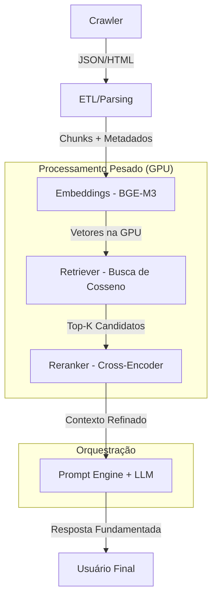

# IA_leg — Revisor Fiscal Inteligente (SEFIN-RO)

Sistema de **Retrieval-Augmented Generation (RAG)** de alta performance desenvolvido para consulta, análise e fundamentação na legislação tributária de Rondônia. O sistema permite buscas em linguagem natural, oferecendo respostas precisas acompanhadas de citações diretas dos dispositivos legais (Artigos, Parágrafos, Incisos).

---

## 🚀 Arquitetura RAG de 6 Estágios

O projeto utiliza um pipeline avançado para garantir que a IA não apenas "converse", mas fundamente cada palavra na legislação vigente.



### Detalhes Técnicos:
1.  **Crawler**: Coleta automatizada da API de Legislação da SEFIN.
2.  **ETL**: Segmentação inteligente em artigos e dispositivos, preservando a hierarquia jurídica.
3.  **Embeddings (GPU)**: Uso do modelo **BGE-M3** para transformar textos em vetores densos.
4.  **Retriever**: Filtro inicial ultra-rápido usando similaridade de cosseno com cache em memória.
5.  **Reranker (Cross-Encoder)**: Refinamento de precisão usando **ms-marco-MiniLM-L-6-v2** para reordenar os resultados.
6.  **LLM**: Geração final via **Ollama (Qwen 2.5 14B)** otimizado para português.

---

## 🛠️ Configuração do Ambiente

### 1. Pré-requisitos
*   **Hardware**: Recomendado NVIDIA GPU (RTX 3060 12GB+).
*   **Software**: Conda (Miniconda/Anaconda), Python 3.11+, Ollama.

### 2. Instalação Passo a Passo

```bash
# 1. Criar e ativar o ambiente
conda create -n leg_ia python=3.11 -y
conda activate leg_ia

# 2. Instalar PyTorch com suporte CUDA 12.1+ (Essencial para RTX 30/40)
pip install torch torchvision torchaudio --index-url https://download.pytorch.org/whl/cu121

# 3. Instalar dependências do projeto
pip install pandas sentence-transformers requests numpy polars python-dotenv

# 4. Instalar dependências do Frontend
cd frontend
npm install
```

### 3. Configuração do LLM (Ollama)
Certifique-se que o Ollama está rodando e baixe o modelo:
```bash
ollama pull qwen2.5:14b-instruct-q4_K_M
```

---

## 🏃 Como Inicializar

### A. Indexação (Apenas se houver novos dados)
Para processar a legislação e criar a base vetorial:
```bash
python rag/embeddings.py
```
*Tempo estimado: ~5-10 minutos com GPU ativa.*

### B. Iniciar Interface Principal
```bash
cd frontend && npm run dev
```

### C. Teste de Relevância (CLI)
Para validar a precisão do buscador sem interface:
```bash
python tests/test_reranker_relevancia.py
```

---

## 📂 Estrutura de Pastas
*   `rag/`: Core do motor RAG (Embeddings, Retriever, Reranker).
*   `frontend/`: Interface React (SPA).
*   `dashboard/`: Interface Streamlit (Legado).
*   `etl/`: Scripts de limpeza e estruturação de dados.
*   `database/`: Armazenamento SQLite (`metadata.db`).
*   `config.py`: Parâmetros globais de modelos e caminhos.

---

## 🔧 Solução de Problemas

*   **CUDA não detectado**: Execute `python test_gpu.py`. Se falhar, verifique os drivers da NVIDIA.
*   **Erro de Memória (OOM)**: O modelo Qwen 14B requer ~10GB de VRAM. Se tiver menos, altere para `llama3:8b` no `config.py`.
*   **Ollama não responde**: Verifique se o serviço está ativo (`ollama list`).

---
**SEFIN-RO** | Desenvolvimento Interno | 2026
